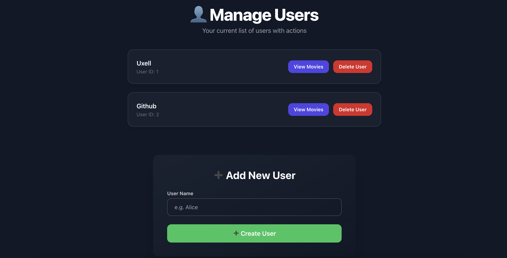
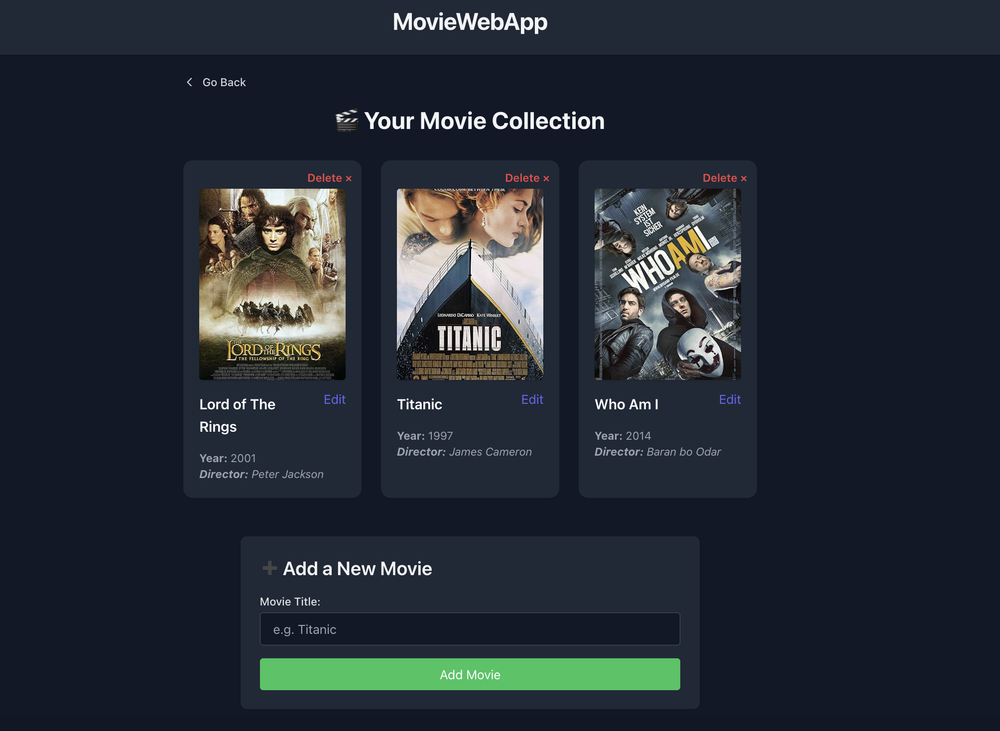

# 🎬 Uxell Movie Web App

A full-stack Flask-based movie collection manager that allows you to:
- Create users
- Add, update, and delete movies per user
- Automatically fetch movie details (poster, director, year) from OMDb API
- Enjoy a modern Tailwind CSS dark-mode UI

---

## 🚀 Features

- 📂 User management: create and delete users
- 🎞️ Movie management: add (with OMDb API), edit, delete
- 🌐 OMDb API integration to auto-fill poster, director, and year
- 🎨 Responsive, aesthetic UI styled with Tailwind CSS (v4.1)
- 🌑 Dark mode by default

---

## 🛠️ Tech Stack

- **Backend**: Flask, SQLAlchemy, SQLite
- **Frontend**: Jinja2, Tailwind CSS (via CDN)
- **API**: [OMDb API](https://www.omdbapi.com/)
- **Database**: SQLite

---

## 📦 Installation

1. **Clone the repository**:
   ```bash
   git clone https://github.com/Kasayka1999/Movie_Project.git
   cd Movie_Project
   ```

2. **Create a virtual environment**:
   ```bash
   python -m venv venv
   source venv/bin/activate  # On Windows: venv\Scripts\activate
   ```

3. **Install dependencies**:
   ```bash
   pip install -r requirements.txt
   ```

4. **Create the database**:
   ```bash
   python
   >>> from app import db
   >>> db.create_all()
   >>> exit()
   ```

5. **Add your OMDb API key**:
   - Create a `.env` file:
     ```
     OMDB_API_KEY=your_api_key_here
     ```

6. **Run the app**:
   ```bash
   flask run
   ```

---

## 📸 Screenshots

Dark-mode UI with grid layout, modal updates, and responsive design using TailwindCSS.




---

## ✨ Credits

Built by [@Kasayka1999](https://github.com/Kasayka1999)

---

## 📄 License

MIT License
